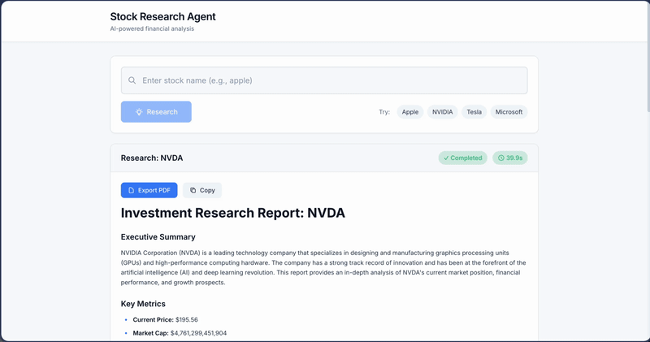
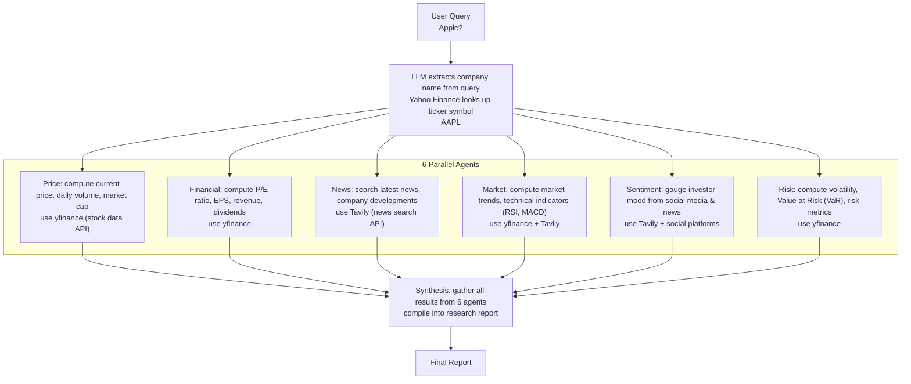

# Stock Research Agent

AI-powered multi-agent stock research system using **CrewAI** framework

## Features

- **Multi-Agent System**: 6 specialized AI agents running in parallel 
- **Natural Language Queries**: ask in plain English like "How is Apple doing?" and the system will understand which company you mean
- **Structured Outputs**: Type-safe Pydantic models for all agent responses
- **Real-time Data**: fetch stock prices, financial data from yfinance; search latest news from Tavily API; gather investor discussions from Reddit, Twitter, Stocktwits
- **Async Processing**: Background task processing with job status tracking

## Demo



## Architecture

<div align="center">



</div>

## Tech Stack

| Component | Technology |
|-----------|------------|
| **Agent Framework** | CrewAI 1.9.x |
| **LLM API** | NVIDIA NIM (Llama 3.3 70B) |
| **Protocol** | MCP (Model Context Protocol) |
| **Search API** | Tavily |
| **Stock Data** | yfinance |
| **Backend** | FastAPI |
| **Frontend** | React + TypeScript + Vite |
| **Deployment** | Docker |

## MCP (Model Context Protocol)

This project uses MCP to define tools that LLM agents can call:
- **stock_research**: run full research on a stock (calls all 6 agents)
- **stock_get_price**: fetch current stock price, volume, market cap
- **stock_get_financial_metrics**: fetch P/E, EPS, revenue, dividends
- **stock_search_news**: search latest news and company developments
- **stock_analyze_sentiment**: gauge investor mood from news & social media
- **stock_analyze_risk**: compute volatility, VaR, risk metrics
- **stock_get_price_history**: fetch historical price data
- **stock_parse_query**: extract company name and ticker from natural language
- **stock_extract_company**: extract company name from query
- **stock_lookup_ticker**: look up ticker symbol by company name

MCP standardizes how agents communicate with external APIs (yfinance, Tavily).

## Quick Start

### Prerequisites

- Python 3.12+
- [uv](https://docs.astral.sh/uv/) (recommended) or pip
- NVIDIA NIM API key
- Tavily API key

### Installation

```bash
cd stock-research-agent

uv sync

cp .env.example .env
```

Edit `.env` with your API keys:

```bash
NVIDIA_API_KEY=nvapi-xxxxxxxxxxxxx
TAVILY_API_KEY=tvly-xxxxxxxxxxxxx
```

### Running

**FastAPI Backend:**
```bash
uv run uvicorn backend.main:app --reload --port 8000
```

**Frontend:**
```bash
cd frontend
npm install
npm run dev
```

**Docker:**
```bash
docker compose up --build
```

## Usage

### REST API

```bash
curl -X POST http://localhost:8000/api/research \
  -H "Content-Type: application/json" \
  -d '{"query": "How is Apple stock doing?"}'
```

Response (job creation):
```json
{
  "job_id": "abc-123",
  "status": "pending",
  "message": "Research job queued"
}
```

Get result:
```bash
curl http://localhost:8000/api/research/abc-123
```

### Python API

```python
from backend.orchestrator.orchestrator import MCPOrchestrator

orchestrator = MCPOrchestrator()
result = orchestrator.execute_sync("How is Tesla doing?")

print(result.final_report)
```

## Project Structure

```
stock-research-agent/
├── backend/
│   ├── main.py                    # FastAPI app entry point
│   ├── mcp_server.py              # MCP protocol server (optional)
│   ├── api/
│   │   └── routes.py              # REST API endpoints
│   ├── config/
│   │   └── settings.py             # Configuration management
│   ├── middleware/
│   │   └── rate_limiter.py        # Rate limiting
│   ├── orchestrator/
│   │   ├── orchestrator.py           # Multi-agent orchestration
│   │   └── query_analyzer.py         # NLP query parsing
│   ├── crew/
│   │   └── llm_config.py          # LLM configuration
│   ├── tools/
│   │   ├── stock_data.py          # yfinance integration
│   │   ├── tavily_search.py       # Tavily search
│   │   ├── sentiment_analysis.py  # Social sentiment
│   │   ├── risk_analysis.py       # Risk metrics
│   │   ├── entity_extraction.py   # Company name extraction
│   │   ├── ticker_lookup.py        # Ticker symbol lookup
│   │   └── utils.py               # Utilities
│   └── models/
│       ├── outputs.py              # Pydantic output models
│       └── schemas.py              # API request/response schemas
├── frontend/
│   ├── src/
│   │   ├── App.tsx
│   │   ├── components/
│   │   │   ├── ResearchForm.tsx
│   │   │   └── ResearchResult.tsx
│   │   └── index.css
│   ├── package.json
│   └── vite.config.ts
├── tests/
│   └── test_mcp.py
├── docs/
│   ├── API.md
│   ├── AGENTS.md
│   └── TOOLS.md
├── mcp.json
├── docker-compose.yml
├── pyproject.toml
└── README.md
```

## API Endpoints

| Method | Endpoint | Description |
|--------|----------|-------------|
| POST | `/api/research` | Create research job |
| GET | `/api/research/{job_id}` | Get job status/result |

## Environment Variables

| Variable | Description | Default |
|----------|-------------|---------|
| `NVIDIA_API_KEY` | NVIDIA NIM API key | Required |
| `TAVILY_API_KEY` | Tavily API key | Required |
| `NVIDIA_MODEL` | LLM model name | `meta/llama-3.3-70b-instruct` |
| `MAX_REQUESTS_PER_MINUTE` | Rate limit | 40 |
| `API_PORT` | Server port | 8000 |

## Testing

```bash
uv run pytest tests/test_mcp.py -v
```
